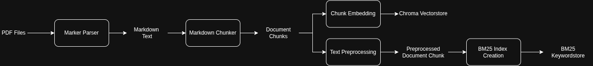
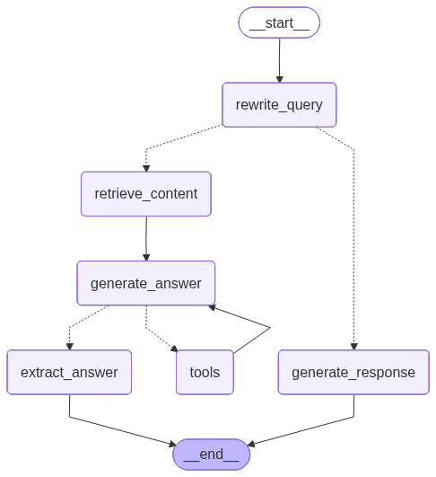

# Ask Your Fundamentals

This project implements an end-to-end Retrieval-Augmented Generation (RAG) system designed to process 10-K filings and annual report PDFs of public companies. The system enables analytical question answering about business performance based solely on information extracted from the uploaded documents. It consists of two main components:

1. **Index Ingestion Pipeline**: Takes uploaded annual report PDFs as input and generates a vector store and keyword store for efficient retrieval.
1. **RAG Pipeline** Utilizes these data stores to retrieve relevant information and generate accurate, context-aware answers to user queries, using only the content from the uploaded PDFs.

# Project Structure

When uploading PDFs of annual reports for a public company, we make the following assumptions about the folder structure: each PDF report must be organized by the company’s ticker symbol (e.g., AAPL, AMZN), and each PDF file should be named according to the corresponding reporting year (e.g., 2023.pdf). See the example below for the expected directory layout:

```python
/src/
└── evaluation_pipeline.py          # Evaluation script to evaluate the retrieval and end-to-end performance of the RAG pipeline.
└── chat_terminal.py                # Starts a chat terminal that communicates with the RAG chatbot via FastAPI endpoint
└── app.py                          # FastAPI endpoint for invoking the RAG chatbot graph
└── mapper.py                       # Returns the appropriate class to instantiate depending on the arguments passed.
└── qa_creator.py                   # Script to sample questions from the T^2-RAGBench and create the dev set to evaluate our RAG pipeline.
└── utils.py                        # Utility tools and functions used by RAG pipeline evaluation.
└── index_ingestion/               
    └── marker_parser.py            # Defines the parser class that uses the Marker library to convert PDF files into a Markdown format
    └── markdown_chunker.py         # Defines the chunker class that uses Markdown header splitter to chunk parsed document into smaller chunks.
    └── ingestion_main.py           # Defines the index ingestion class that combines the logic of the parser and the chunker.
    └── utils.py                    # Utility tools and functions used by index ingestion pipeline.
└── rag_architecture/              
    └── graph_constructor.py        # Constructs the RAG pipeline and connect different components in the pipeline together
    └── components/
        └── extract_answer.py       # Node for extracting the answer and citation generated by the LLM.
        └── generate_answer.py      # Node that uses tool-calling agent to perform mathematical calculations or generate final answer.
        └── generate_response.py    # Node for generating answer to user queries that are not relevant to the topics in the RAG system.
        └── retrieve_content.py     # Retrieve relevant chunks from the vectorstore and keyword store.
        └── rewrite_query.py        # Node to contextualise the user query based on the conversation history and determine intention of user.
        └── schemas.py              # Defines all the Pydantic schemas used in the RAG pipeline.
        └── utils.py                # Utility tools and functions used by the RAG pipeline.

/data/
└── reports/                        # Contains the uploaded PDF reports organised in the expected layout for the parser to function correctly.
    └── GS/
        └── 2012.pdf
        └── 2013.pdf
    └── JPM/
        └── 2013.pdf
        └── 2014.pdf
└── parsed_reports/                 # Contains the parsed markdown document stored in a JSON format
    └── GS/
        └── 2012.json
        └── 2013.json
    └── JPM/
        └── 2013.json
        └── 2014.json
        

/config/
└── settings.yaml                   # Configuration file specifying the configuration for the index ingestion and RAG pipeline.


```

# Evaluation Dataset

To evaluate our RAG pipeline, we constructed an evaluation dataset based on the T^2-RAGBench benchmark. The T^2-RAGBench contains 32,908 question–ground truth context–ground truth answer triples designed to assess RAG methods using real-world financial data. After conducting EDA on the benchmark, we identified Goldman Sachs (GS) as the company with the highest number of associated questions and selected it as the focus of our evaluation.

## Dataset Composition
To construct our dataset, we collected publicly available annual report PDFs for Goldman Sachs (GS) across multiple years (**2012-2014**, **2016-2017**) and curated a set of 60 evaluation questions from the benchmark, structured as follows:
- **Answerable Questions** (70% – 42 questions): These questions focus on GS’s performance and can be directly answered using information contained in the collected annual reports.
- **Unanswerable Questions** (15% – 9 questions): These questions also concern GS but cannot be answered because the necessary information is not present in the available reports. For example, a question about GS’s profit in 2007 would be unanswerable since we only collected reports between **2012-2014** and **2016-2017**
- **Negative Questions** (15% – 9 questions): These questions are unrelated to GS, such as those concerning other financial institutions like JP Morgan or BlackRock.

## Sample Questions

| Question Type | Question | 
| --------------| ---------|
| Answerable | What were the average incentive fees in millions for the three-year period from 2010 to 2012, as reflected in the operating results of Goldman Sachs' investment management segment?|
| Answerable | What percentage of the 2011 net interest income did the $3.88 billion net interest income in 2012 represent for Goldman Sachs?|
| Unanswerable | What percentage of Goldman Sachs' total net revenues in the Institutional Client Services segment for the year ended December 2015 was attributed to Fixed Income, Currency, and Commodities client execution?|
| Negative | What is the cumulative value of income from continuing operations and loss from discontinued operations, net of tax, per diluted share for the Charles Schwab Corporation in 2008?|

# Methodology
## Index Ingestion Pipeline

The diagram below illustrates our index ingestion pipeline. Starting with a PDF file, we first convert it into Markdown using the **Marker parser**. The resulting Markdown files are then split into smaller, manageable chunks, which are embedded with the **gemini-001-embedding** model and stored in a **Chroma** vectorstore. In parallel, these chunks are further preprocessed to build a **BM25 keyword index** for efficient keyword-based retrieval.



### Marker Parser

We use the **Marker parser** library to convert PDF files into Markdown. While alternatives like PyMuPDF and Llamaparse were considered, Marker proved superior:  

- Compared to PyMuPDF, Marker generates cleaner and more structured Markdown by leveraging computer vision models to interpret PDF layout and formatting.  
- Unlike Llamaparse, Marker is faster and more cost-effective, as it runs locally without relying on external API calls.  

The parsing process begins with **page classification**, determining whether a page is text-searchable or scanned based on the image-to-text area ratio and the presence of searchable text.  

- **Text-searchable pages**: Converted directly to Markdown without OCR.  
- **Scanned pages**: Undergo OCR to extract text content.  

To reduce noise, we configured Marker to automatically remove headers and footers, which often contain repeated or irrelevant information such as page numbers or disclaimers. Marker runs its computer vision models using local GPU resources, so we decided to perform parsing page by page to efficiently manage memory. For each page, metadata such as the presence of images or tables and page numbers is also collected to support downstream processing and analysis.

### Markdown Chunker

After converting PDFs to Markdown, we use a **custom chunker** to split documents into smaller, indexable chunks. The process includes:

1. **Cleaning the Markdown text**: Remove noise by replacing image tags and hyperlinks with alt text, stripping HTML and standalone URLs, and normalizing whitespace.  

2. **Header-based chunking**: Financial reports are often structured with clear headers. Using LangChain’s **MarkdownHeaderTextSplitter**, we split the Markdown based on header hierarchy, keeping content under the same header together.  

3. **Merging and overlapping chunks**: Very small chunks are merged to achieve a balanced chunk size. Overlaps between consecutive chunks are added to maintain context continuity and prevent loss of important information spanning sections.


### Chroma Vectorstore and Gemini Embeddings

We use **Chroma** as our vectorstore due to its popularity, strong LangChain support, and ease of setup. For generating embeddings, we use **Gemini**, which ranks among the top models on the [MTEB leaderboard](https://huggingface.co/spaces/mteb/leaderboard) for semantic similarity retrieval, ensuring high-quality vector representations for our data.


### BM25 Keywordstore

We use **BM25** as our keyword-matching algorithm. While alternatives like TF-IDF are possible, BM25 provides better relevance ranking by accounting for term frequency saturation and document length, making it more effective at retrieving the most relevant matches.

To build the BM25 index, we preprocess the chunked text to enhance search performance and reduce noise. This includes:

1. **Text Normalization**: Convert text to lowercase and remove punctuation for case-insensitive matching.  This ensures that the word "Case" still match with the word "case".
2. **Tokenization**: Break text into smaller tokens for analysis.  For example, "I like coding" is tokenised into 3 tokens: "I" , "like" and "coding".
3. **Stopword Removal**: Remove common words (e.g., “and,” “I,” “you”) that carry little semantic meaning.  
4. **Stemming**: Reduce words to their root form so that variations (e.g., “connection,” “connected,” “connecting”) are treated equivalently, improving match accuracy.


## RAG Pipeline

The diagram below illustrates our RAG pipeline. 

<p align="center">
  
</p>


### Rewrite Query Node 


The main functionality of the **rewrite_query** node is to perform two tasks: **query contextualization** and **query intention classification**.


**Query Contextualisation**

When users interact with a chatbot, the conversation is typically **multi-turn** rather than a single one-off question. This means users often engage in back-and-forth exchanges, asking follow-up questions that depend on the previous context. Therefore, it is crucial to **contextualize** each user query based on the conversation history. Without this, the chatbot may fail to understand questions that rely on prior context.

For instance, if a user first asks, *“What was JPMorgan’s profit in 2024?”* and then follows up with, *“What about its profit in 2025?”*, the second question alone would be ambiguous—since the reference to “it” would lack context. To address this, we introduced a query contextualisation step in this node that reformulates the user’s query by incorporating relevant details from the conversation history. This ensures that the rewritten query is **self-contained**, **context-independent**, and fully understandable on its own.

**Query Intention Classification**

When users interact with a chatbot, their queries are not always valid or relevant. In some cases, users may ask off-topic or sensitive questions that the chatbot should not respond to—such as those related to politics, religion, or inappropriate content. Therefore, it is essential to first classify the **intention** of each query so that it can be handled appropriately by the system.

We designed our chatbot to detect five main types of query intentions:

- **relevant**: The user asks a fundamental analysis question about one or more companies whose annual PDF reports have been uploaded.
- **irrelevant**: The user asks a fundamental analysis question about companies whose annual PDF reports have *not* been uploaded.
- **vague**: The user’s question pertains to fundamental analysis but lacks sufficient detail or does not specify the company of interest.
- **unclear**: The input contains slang, severe typos, garbled text, or incoherent phrasing, making the intention impossible to understand (e.g., “Wht wsa finnc prformnce o cmpny?”, “newnvkwvewfeh”, “rev inc flp chart go upz??”, “BLK inc flp chart go upz??”).
- **general**: The user asks a non-fundamental or general conversational question (e.g., “Hello”, “How are you?”, “What is AI?”, “Where is Tesla’s headquarters?”, “What new smartphone models did Samsung release in 2025?”).

If a query is classified as **relevant**, the chatbot uses the RAG system to retrieve relevant information from the vectorstore and keywordstore, and then employs an LLM to generate a response using the retrieved content.  For all other intentions, the chatbot redirects the flow to the **generate_response** node, where predefined text responses are used to reply appropriately based on the detected intention.  Although an LLM could have been used to make these responses more dynamic, we opted for fixed responses to reduce token costs and improve efficiency.

### Retrieve Content Node

The primary function of the **retrieve_content** node is to perform a hybrid search to retrieve relevant documents using both semantic vector search and BM25 keyword search, followed by re-ranking with the Cohere Reranker to enhance retrieval performance.  

**Hybrid Search**  

Hybrid search combines the strengths of vector search and BM25 keyword search. Initially, the top 15 documents are retrieved separately from both search methods. These results are then merged using weighted reciprocal rank fusion (RRF), with equal weights of 0.5 assigned to each method. Depending on the number of overlapping documents between the two searches, the total number of retrieved documents ranges from a minimum of 15 to a maximum of 30.  

We chose hybrid search because vector and keyword searches complement each other. Vector search excels at capturing semantic similarity and retrieving documents that are conceptually related to the query, while keyword search (BM25) performs better when exact query terms are present in the documents. This combined approach ensures more robust and comprehensive retrieval, especially for queries containing nuanced meanings or domain-specific terminology that a single method might miss. The number of documents retrieved from each search and their weighting were determined based on experimental results.  

**Cross-Encoder Reranking**  

After hybrid search, the retrieved documents are passed to the **Cohere Reranker (Cohere Rerank v3.5)** for reranking. The top 10 documents are then selected for answer generation. To further optimize relevance, these documents are reordered so that the most relevant pieces are positioned at the beginning and end of the context window, while less relevant documents are placed in the middle.  

Reranking enhances the quality and relevance of the retrieved documents by analyzing the interaction between the query and each document in a more fine-grained manner than the initial retrieval step. This is achieved using a cross-encoder architecture, which evaluates each document in the context of the query, allowing for more precise relevance scoring. We selected the Cohere Reranker because it is a widely adopted, high-performance, closed-source model that does not require self-hosting, simplifying deployment.

After reranking, the top documents are reordered to address the [lost in the middle](https://arxiv.org/abs/2307.03172) effect, a scenario where highly relevant documents could be overlooked if they appear in the middle of the context window. By placing the most relevant documents at the beginning and end, we ensure that critical information is highly visible to the answer generation model, thereby maximizing its impact on the generated response and improving overall accuracy and relevance.

### Generate Answer Node

The **generate_answer** node constructs a response by using the documents retrieved from the **retrieve_content** node along with the user’s query. The answer is generated exclusively from the information contained in the retrieved documents. We implemented a ReACT architecture for this process, in which a tool-calling LLM performs reasoning on the retrieved content, carries out any necessary calculations, and produces the final answer.  

For the LLM, we used **gpt-4.1-mini**, which is binded with two tools: a calculator and a structured output schema. The calculator is employed when the LLM needs to perform mathematical operations using figures or statistics from the retrieved documents—particularly useful for fundamental analysis questions. During execution, the LLM alternates between reasoning and invoking the calculator, and once all computations are complete, it uses the structured output schema to generate the final answer.

The final response includes both the answer text and citations. Citations are provided to ensure traceability, allowing users to verify the source of the information. This is especially important because the LLM can sometimes produce hallucinated or unfaithful content. Including citations enhances transparency and allows users to cross-check the answer against the original sources if they have doubts about the LLM’s response.


# Evaluation

We evaluated our RAG pipeline end-to-end using a combination of LLM-as-a-judge and human grading. First, each question in our evaluation set was passed through the RAG pipeline, and the pipeline’s answer was recorded. Next, we used LLM-as-a-judge (**gpt-4.1-mini**) to compare each answer to the ground truth and assign a score of 1 if it matched or 0 if it did not. Finally, we manually skimmed through and reviewed the LLM-assigned scores to double-check accuracy and adjusted any scores if necessary. The table below summarises the results: 


| Model | Answer Correctness | Elapsed Time |   | Token Usage |   |
|-------|--------------------|---------------|---|--------------|---|
|       |                    | Mean | Std  | Mean | Std |
| gpt-4.1-mini | 0.049 | 6.84 | 3.45 | 1242 | 654 |
| gpt-4.1-mini with Chroma Vectorstore | 0.780 | 4.19 | 1.70 | 19278 | 9327 |
| gpt-4.1-mini with Hybrid Search and Rerank | 0.797 | 5.59 | 2.19 | 26920 | 20199 |
| <u>**Final RAG Pipeline**</u> | <u>**0.915**</u> | <u>**6.40**</u> | <u>**2.49**</u> | <u>**20738**</u> | <u>**11005**</u> |

Our final RAG pipeline achieved an answer correctness score of 91.5% on our 60-question evaluation dataset, with an average latency of 6.40 seconds and average token usage per question of 20,738 tokens


## Installation & Project Setup

This section provides instructions on how to install and set up the project locally. Before you begin, please ensure you have the following prerequisites:

1. `uv` ,`Docker` and `bash` installed on your system.
2. A valid `GOOGLE_API_KEY` for accessing **gemini-embedding-001** embedding, `OPENAI_API_KEY` for accessing **GPT** models and `COHERE_API_KEY` for accessing the **Cohere reranking-v3.5** model.

Steps to Run the Index Ingestion and RAG Pipeline:

1. Create a virtual environment with the neccessary packages using `uv sync --all-extras`.
2. Create a `.env` file in the root directory of the project.
3. Add your credentials to the `.env` file in the following format:
```
GOOGLE_API_KEY=<google_api_key>
OPENAI_API_KEY=<openai_api_key>
COHERE_API_KEY=<cohere_api_key>
```
4. To converse with the RAG chatbot: 
    1. Execute the following command to startup a docker container: `bash docker.sh`
    2. Execute the following command to open a chat terminal that communicates with docker container via FastAPI : `uv run python -m src.chat_terminal`
5. To run the index ingestion pipeline:
    1. Upload the PDF files to the `data/reports` directory following the format described above 
    2. Execute the following command: `uv run python -m src.index_ingestion.ingestion_main`
